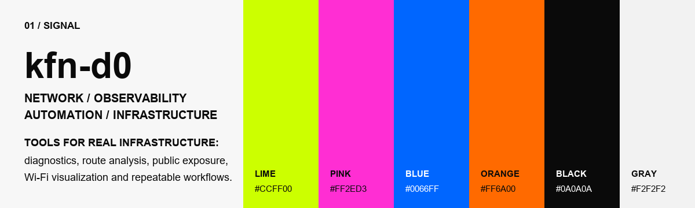

 

<table width="100%">
  <tr>
    <td width="25%" valign="top">
      <b>02 / FOCUS</b>
    </td>
    <td width="75%" valign="top">
      <b>Rede</b> / troubleshooting, ICMP, rotas, subdomínios, ASN, Wi-Fi 
      <b>Infra</b> / Linux, Windows, Grafana, Zabbix, auditoria e backup 
      <b>Software</b> / C++, C#, Python, Java, JavaScript, TypeScript 
      <b>Automação</b> / coleta de dados, ferramentas locais e processos repetíveis
    </td>
  </tr>
</table>

 

  
  
  
  
  
  
  
  
  
  
  
  
  

 

## 03 / Projetos em destaque

| Projeto | Sinal | Stack |
| --- | --- | --- |
| [netfetch](https://github.com/kfn-d0/netfetch) | Neofetch para informações de rede, com suporte a Linux e Windows. | C++ |
| [ISP_Risk_Scanner](https://github.com/kfn-d0/ISP_Risk_Scanner) | Análise de superfície de exposição pública de IPs em ASNs. | Python, Docker |
| [Wireless-Network-Visualizer](https://github.com/kfn-d0/Wireless-Network-Visualizer) | Simulador de cobertura Wi-Fi e heatmap baseado no modelo ITU-R P.1238. | JavaScript |
| [RotaFacil](https://github.com/kfn-d0/RotaFacil) | Projeto simples para cálculo e visualização de rotas com mapas. | JavaScript, Leaflet |
| [QuickAuditLinux](https://github.com/kfn-d0/QuickAuditLinux) | Auditoria rápida para VMs Linux. | Python |
| [ISPdiag](https://github.com/kfn-d0/ISPdiag) | Diagnóstico de conectividade de rede em dispositivos Android. | Java, Android |
| [NetworkAnalysisSuite](https://github.com/kfn-d0/NetworkAnalysisSuite) | Análise avançada de rotas, similar ao WinMTR com recursos extras. | C#, .NET |
| [DDNScover](https://github.com/kfn-d0/DDNScover) | Reconhecimento passivo para descoberta rápida de subdomínios. | C# |
| [Corp_Assist](https://github.com/kfn-d0/Corp_Assist) | Assistente RAG para documentos internos com Qdrant, Neo4j e BM25. | Python |

## 04 / Outros projetos

- [GrafanaBackup](https://github.com/kfn-d0/GrafanaBackup): backup automatizado de dashboards do Grafana.
- [PORTyscan](https://github.com/kfn-d0/PORTyscan): scanner de portas para Windows.
- [HTTPresponsetimer](https://github.com/kfn-d0/HTTPresponsetimer): extensão Chrome para medir tempo de resposta HTTP.
- [OSCM_camera_monitor](https://github.com/kfn-d0/OSCM_camera_monitor): monitoramento open source de câmeras.
- [localicmphosttest-LIHT](https://github.com/kfn-d0/localicmphosttest-LIHT): simulação de rede para desenvolvedores e administradores.

## 05 / Links

- Portfolio: [cfprojects.pages.dev](https://cfprojects.pages.dev/)
- GitHub: [@kfn-d0](https://github.com/kfn-d0)
